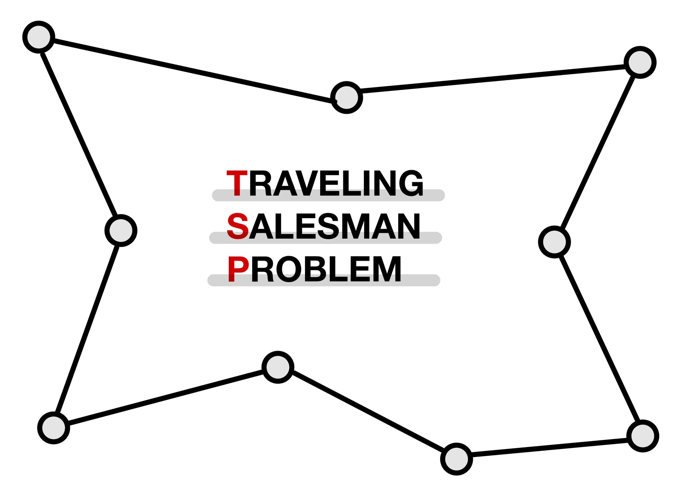
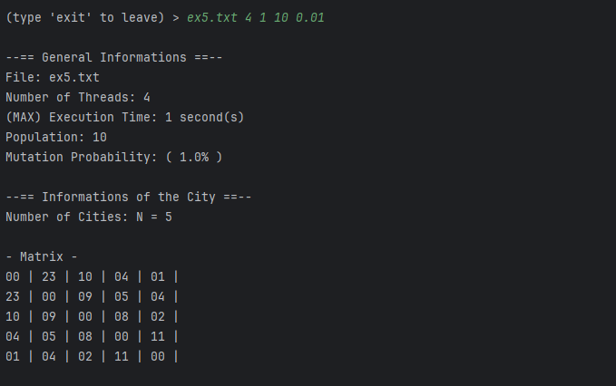
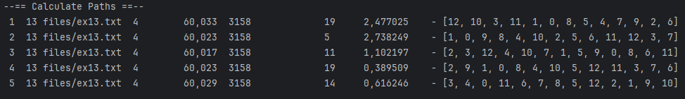
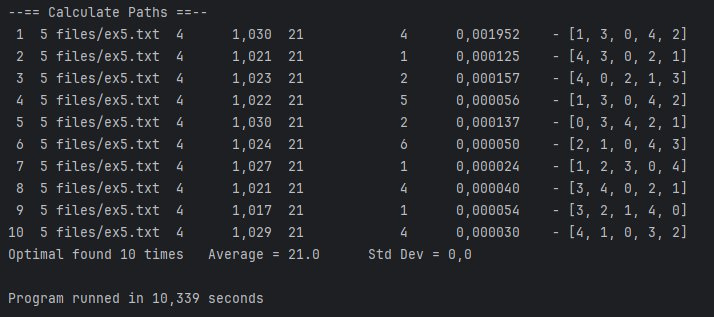
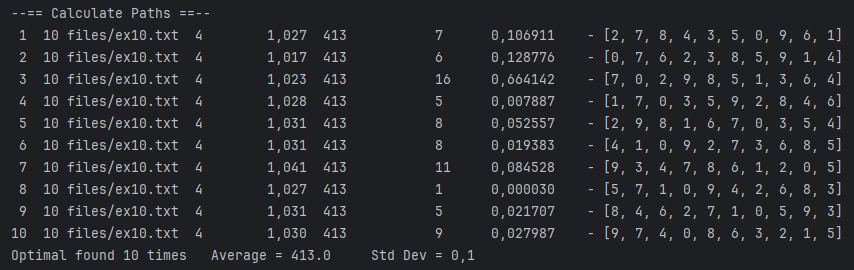

# TSP - Traveling Salesman Problem Solver (Java)

**SDK:** Oracle OpenJDK version **21.0.1**

- Make sure to ⭐️ the repository to stay tuned! 

## Overview 🔍

This Java-based project aims to solve the **Traveling Salesman Problem (TSP)** using a parallelized approach with multithreading and the Partially Mapped Crossover (PMX) technique. The TSP is a classic optimization problem where the goal is to find the most efficient route that visits a set of cities exactly once and returns to the starting city.



---

## Features ✅

### 1 - Multithreading

The solution utilizes multithreading to concurrently explore different paths in the solution space, improving the overall efficiency of the algorithm. This enables the program to explore multiple potential solutions simultaneously, leading to faster convergence towards an optimal or near-optimal solution.

### 2 - PMX Crossover

The genetic algorithm incorporates the PMX crossover technique to create diverse offspring. PMX ensures that the child solutions inherit parts of their parents' paths, preserving the integrity of the route while introducing variability. This enhances the algorithm's ability to explore and converge towards optimal solutions.

### 3 - Mutation Probability

The genetic algorithm incorporates a mutation mechanism with adjustable probability. Mutation introduces diversity in the population by randomly altering some solutions, preventing premature convergence to suboptimal solutions. Users can fine-tune the mutation probability to strike a balance between exploration and exploitation.

### 4 - Population

The genetic algorithm maintains a population of potential solutions, evolving them over generations. A diverse population helps the algorithm explore a broader solution space. Users can configure the size of the population based on the characteristics of the TSP instance, allowing for flexibility in handling different problem complexities.

### 5 - Max Time of Execution

To control the execution time of the algorithm, a maximum time parameter is provided. This ensures that the algorithm terminates gracefully even if an optimal solution is not found within a specified timeframe. Users can set this parameter to meet specific time constraints, making the solution adaptable to different scenarios.

---

## Showcase 🔭

|                                         |                                            |
|               :---:                     |                 :---:                      |
|        |         |
|        |         |

---

## How it works? 🛠️

### Parameters

To execute the TSP solver you need to fill the following parameters:
```Java
> <fileName> (Already gets from files folder, just put the file name) <threadsNumber> <maxExecTime> (in seconds) <populationNumber> <mutationProbability> (from 0.01 to 1)
```

//Explain the code

### Results
| File      |     Best distance   |
| :---:     | :---: |
| ex5       |    21 |
| ex6       |    23 |
| ex7       |   105 |
| ex8       |   244 |
| ex9       |  1472 |
| ex10      |   413 |
| sp11      |   133 |
| uk12      |  1733 |
| ex13      |  3158 |
| burma14   |  3323 |
| lau15     |   291 |
| ulysses16 |  6859 |
| gr17      |  2085 |
| ulysses22 |  7013 |
| gr24      |  1272 |
| fri26     |   937 |
| dantzig42 |   699 |
| att48     | 33523 |


---

## Why to Open Source 🌐

1. **Community Collaboration**: Open sourcing your project invites a global community of developers to contribute, share ideas, and enhance its capabilities.

2. **Accelerated Development**: With a collective effort, open source projects progress faster, benefiting from diverse skill sets and constant feedback.

3. **Transparency and Trust**: Open source builds trust by allowing users to inspect code, ensuring security and transparency in software.

4. **Cost Efficiency**: It reduces development costs as contributors volunteer their time and resources, making it an economical choice.

5. **Longevity**: Open source projects tend to have longer lifespans, as they are not reliant on a single entity, ensuring sustainability.

---

## Tech Stack ⚡


---

## Installation 📥

> Install TSP Repository with npm *(This will install all files, including this README.md)*
>
> ```bash
>  npm install https://github.com/MiguelRolo/TSP.git
>  cd TSP
> ```

---

## Contribution 🤝

> Feel free to contribute by forking the repository and creating pull requests. Bug reports and feature requests are also welcome in the Issues section.

---

## License 🪪

> **(Apache License, Version 2.0)** You're **free to use** this content and codes in any project, personal or commercial. 
>
> There's no need to ask permission before using theses. Giving attribution is not required, but appreciated.